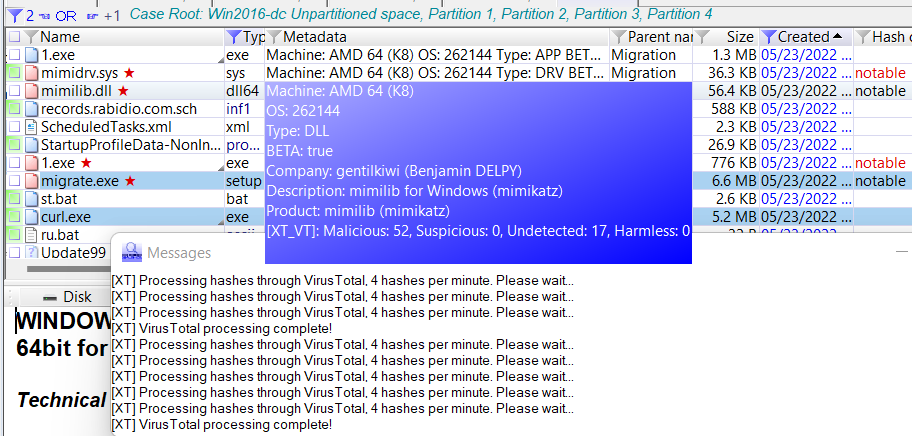

# X-Ways-VirusTotal-Extension
X-Ways Extension to look up hashes in Virus total and identify malicious files

Home of the VirusTotal extension for X-Ways that Polito Inc. developed for use with VirusTotal.

VirusTotal hash query extension for X-Ways Forensics platform. Requires VirusTotal API credentials.
VirusTotal api credentials can be obtained here : https://www.virustotal.com/gui/join-us
Please see our blog post for detailed instructions about how to use this VirusTotal plugin with X-Ways: https://www.politoinc.com/VirusTotal It has been tested on X-Ways versions 19.3 to 20.5 (64-bit only). Additional versions are still being tested for compatibility. 

Feel free to open an issue in GitHub or contact us if you encounter any issues or want to suggest a feature. We will do our best to respond in a timely manner.

Hashes of the files : 

  MD5      put md5hash here                  XT_VirusTotal.dll

 After running plugin, output of results are in Metadata column

<!-- See blog post here for more details and instructions for how to use this extension in X-Ways: -->
<!--  -->

## License
Polito Inc. is providing the Opswat MetaDefender hash query and file submission extension ("this Software") for free for the benefit of the Digital Forensics community. This Software is provided "as is", without any warranty of any kind, express or implied. You may copy, distribute, and use this Software without charge for commercial or non-commercial purposes, provided that you give full credit to its source and you do not sell, rent, or lease it; do not reverse engineer, decompile, or dissassmeble it; and do not use it for any illegal purpose. While we are unable to provide support for this Software, feel free to contact us at  <b>info(at)politoinc.com</b>  with any bug reports or feature requests.
